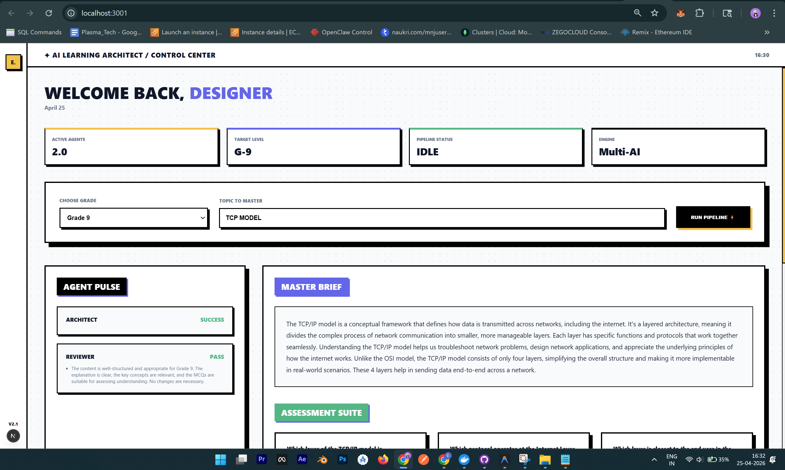
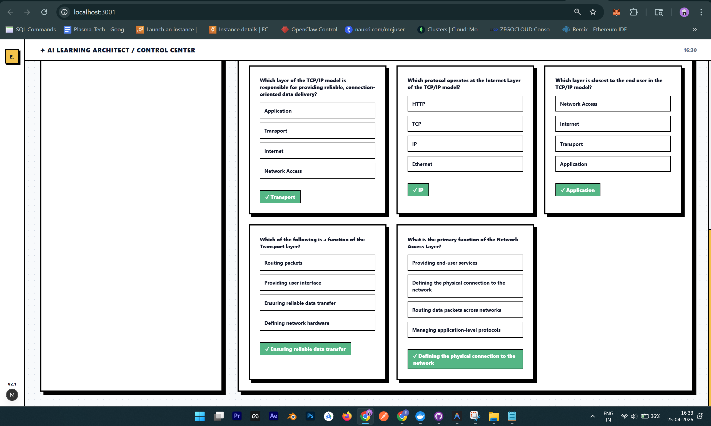

# ✦ Eklavya.me | AI Learning Architect

Eklavya.me is a state-of-the-art AI-powered platform designed to architect personalized educational content. It uses a collaborative multi-agent system to generate, review, and verify learning materials for students from Grade 1 to 12.

---

## 📺 Product Demo

Explore the platform in action:

---

## 📸 Screenshots

### 1. Control Center

*The main control center where architects choose grades and topics to master.*

### 2. Agent Workflow

*Real-time agent pulse tracking the collaboration between the Curriculum Architect and Quality Reviewer.*

---

## 🚀 Core Features
- **Multi-Agent Pipeline**: Uses separate agents for content generation and quality assurance.
- **Dynamic Curriculum**: Tailors vocabulary and complexity based on student grade levels.
- **Resilient Engine**: Powered by OpenRouter (Gemini 2.0 Flash) with automatic fallback systems.
- **Modern UI**: A premium, "Neo-Brutalism" inspired dashboard built with Next.js.

---

## 🛠️ Technology Stack
- **Frontend**: Next.js 15, TypeScript, Vanilla CSS
- **Backend**: FastAPI (Python), Uvicorn
- **AI Engine**: OpenRouter (Gemini 2.0 Flash)
- **Deployment**: Vercel (Frontend), Render (Backend)

---

## 🏃‍♂️ Quick Start

### Backend
1. `cd backend`
2. `pip install -r requirements.txt`
3. `python main.py`

### Frontend
1. `cd frontend`
2. `npm install`
3. `npm run dev`

---

Built with ❤️ for the future of education.
